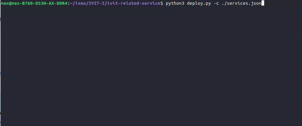
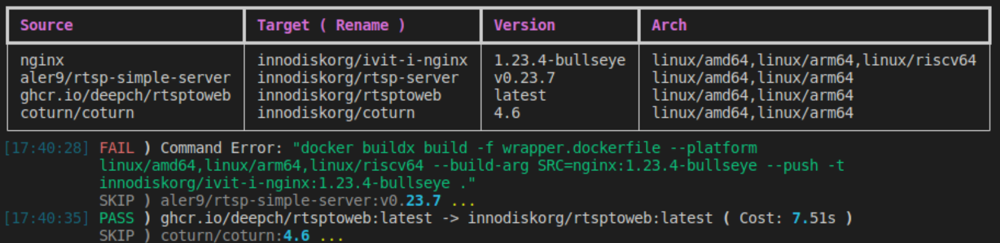

# Docker Image Wrapper
A simple tool can wrap the different architectures ( `linux/arm64`, `linux/amd64`, ... ) docker images to yourself docker hub.
e.g. `{original/service:version} -> {username/service:version}`



# Pre-requirement
* Docker Engine
* `QEMU` for docker `buildx` ( [follow my tutorial](https://maxc.super.site/blogs/db/docker-buildx) )
* Python3 and `rich` module: install `rich` via `pip3 install rich`
* Login docker user via `docker login`  

## Usage
1. Modify [`services.json`](services.json) or just create one.
2. Run [`deploy.py`](deploy.py) with config file.
    ```bash
    # usage: deploy.py [-h] -c CONFIG
    python3 deploy.py -c services.json
    ```

## Configuration
1. `username`: the docker username for pushing to dockerhub
1. `enable`: control the service whether to build or not.
2. `version`: means the source docker image.
3. `source`: the source docker image: `"{source}:{version}"`
5. `target`: the target docker image name: `"{username}/{target}:{version}"`
6. `arch`: the different architectures you want.

```json
{
    "username": "maxc",
    "services": [
       {
            "enable": 0,
            "version":"1.23.4-bullseye",
            "source": "nginx",
            "target": "nginx",
            "arch": "linux/amd64,linux/arm64"
        },
        {
            "enable": 0,
            "version":"v0.23.7",
            "source": "aler9/rtsp-simple-server",
            "target": "rtsp-server",
            "arch": "linux/amd64,linux/arm64"
        }
    ]
}
```


### The workflow for development
Using docker `buildx` to build different architectures.

1. Write a Dockerfile for wrap the source image.
2. Check the support architectures from source image.
3. Using `buildx` to build different architectures.

## Failure Sample
* It will log out whole command for user to debug
    

## Reference
* [docker-image-wrapper](https://github.com/p513817/docker-image-wrapper)